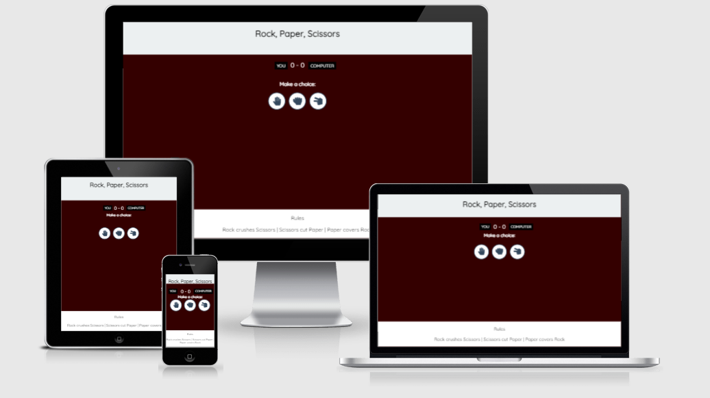
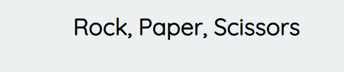
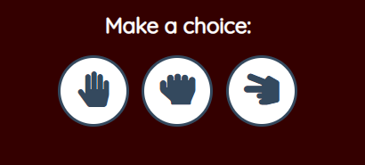
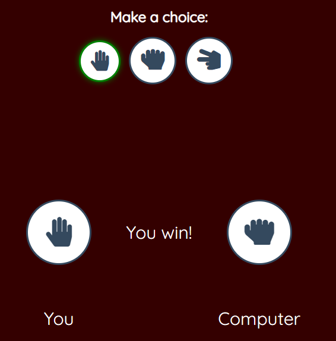
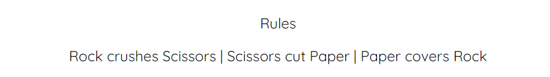
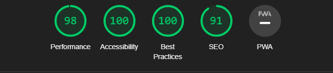

# Rock Paper Scissors

The game Rock, Paper, Scissors has been popular for all ages for many years. It is an easy game to learn and brings joy to those who play. Although in reality it is completely random what kind of "hand" the opponent chooses during the game, you can sometimes expect what the opponent will choose and play the winning hand yourself. If, on the other hand, you play this game online against the computer, it gives an extra moment of excitement as the result is completely impossible to predict.
By playing Rock, Paper, Scissors online, the player gets good conditions to practice and have fun with endless rounds, in order to then be able to beat all their opponents in real life.

## Features 

### Existing features

- Header
   - This header clearly tells the user what game they are playing 

   

-  The Game Options
   - This section provides interactive buttons that the user can click to make their choice and play the game.
   
   

- The Game Result
   - When the user clicks an option, the icon relating to their choice is shown under the three options.
   - The winner is announced to the user under the options buttons, and the score is updated for either the user or computer, depending on who won
   - The results and score are clear to the user, making the game easy to play, understand who won, and what the score is.
   - The Javascript code chooses a random option for the Computer player, displays the icon relating to the computer's choice, and then determines who the winner is.

- The Footer

   - The footer section shows the rules of Rock, Paper, Scissors.
   - The footer is valuable to the user because it clearly explains how the game is played.

### Future features
- Highscores and to be able to create your own username.

## Testing
- I tested that this page works in different browsers: Opera, Chrome, Microsoft Edge
- I confirmed that the game results are always correct.
- I confirmed that this project is responsive. looks good and functions on all standard screen sizes using the devtools device toolbar.

### Validator test

<ul>
<li>Html </li>

No errors were returned when passing through the official W3C validator.

</ul>
<ul>
<li>CSS</li>

 No errors were returned when passing through the official (Jigsaw) validator

</ul>
<ul>
<li>Javascript</li>

No errors were returned when passing through the official JSHint JavaScript Validator

</ul>

## Deployment
- The site was deployed to GitHub pages. The steps to deploy are as follows: 
    
    - Log in to GitHub and locate the GitHub Repository
    
    - At the top of the Repository (not top of page), locate the "Settings" Button on the menu.

    - Scroll down the Settings page until you locate the "GitHub Pages" Section.

    - Under "Source", click the dropdown called "None" and select "Master Branch".

    - Once the master branch has been selected, the page will be automatically refreshed with a detailed ribbon display to indicate the successful deployment. 

The live link can be found here - https://ericolssoon.github.io/Project-2/

## Credits

### Content
- The code to fix the footer was taken from [w3schools](https://www.w3schools.com)

### Media
- The Rock, Paper and Scissors icons were taken from [Font Awesome](https://fontawesome.com/)